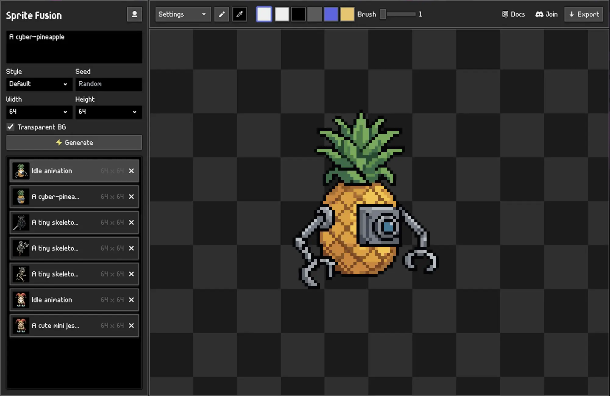

# Sprite Fusion Pixel Snapper

- **Online version**: https://spritefusion.com/pixel-snapper
- **Desktop version**: https://www.spritefusion.com/pixel-snapper#desktop-edition

A tool to snap pixels to a perfect grid. Designed to fix messy and inconsistent pixel art generated by AI.


## Why ?

**Current AI image models can't understand grid-based pixel art.**

- Pixel are inconsistent in size and position.
- The grid resolution can drift over time.
- Colors are not tied to a strict palette.

**With Pixel Snapper:**

- ✅ Pixel are snapped to a perfect grid.
- ✅ The grid resolution is consistent and can be scaled to pixel resolution.
- ✅ Colors are tied to a strict, quantized palette.

## Perfect for

- **AI generated pixel art** that needs to be snapped to a grid.
- **Procedural 2D art that doesn't fit a grid** like tilemaps or isometric maps.
- **2D game assets and 3D textures** that need to be perfectly scalable.


<p align="center"><em>Pixel Snapper preserves as much details as possible like dithering.</em></p>

<br>

## Desktop Application


A standalone build of Pixel Snapper coming with these features:

- Fast batch processing
- 100% offline desktop app
- One-time purchase, yours forever!
- Free lifetime updates
- Works on Mac, Linux, and Windows

[Download the desktop application](https://www.spritefusion.com/pixel-snapper#desktop-edition)

## Build from source

Requires [Rust](https://www.rust-lang.org/) installed on your machine.

### 💻 CLI

```bash
git clone https://github.com/Hugo-Dz/spritefusion-pixel-snapper.git
cd spritefusion-pixel-snapper
```

```bash
cargo run input.png output.png
```

The command accepts an optional k-colors argument:

```bash
cargo run input.png output.png 16
```

Use a directory as the input path to process a batch.

```bash
cargo run sprites/batch_inputs sprites/batch_outputs 16
```

You can also override the auto-detected pixel size with `--pixel-size`:

```bash
cargo run input.png output.png --pixel-size 8
cargo run sprites/batch_inputs sprites/batch_outputs 16 --pixel-size 8
```

This is useful when the auto-detection doesn't match the expected grid size. The value must be between 1 and half the smallest image dimension.

### 🌐 Web (WASM)

```bash
git clone https://github.com/Hugo-Dz/spritefusion-pixel-snapper.git
cd spritefusion-pixel-snapper
```

Build the WASM module:

```bash
wasm-pack build --target web --out-dir pkg --release
```

Then use the WASM module in your project:

```js
import init, { process_image } from "./pkg/spritefusion_pixel_snapper.js";

await init();

// process_image(inputBytes, kColors?, pixelSizeOverride?)
const outputBytes = process_image(inputBytes, 16);
```

Pass `null` for any optional argument you want to leave on its default behavior.

## Acknowledgments

Pixel Snapper is a [Sprite Fusion](https://www.spritefusion.com/pixel-art-generator) project. Sprite Fusion is a tool to generate TRUE pixel art sprites and animations for game development.



## License

MIT License [Hugo Duprez](https://www.hugoduprez.com/)
