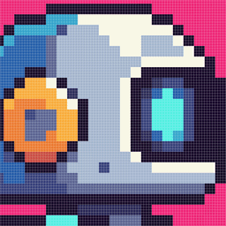
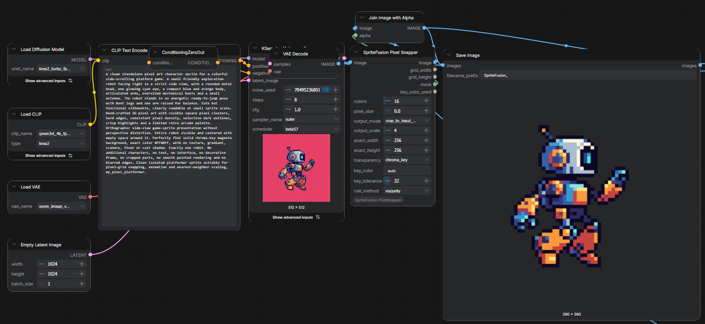
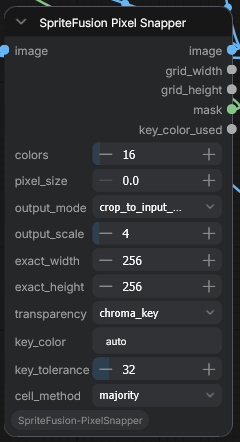

# ComfyUI SpriteFusion Pixel Snapper

Turn approximate AI-generated pixel art into a clean, palette-limited image on a
consistent pixel grid, directly inside ComfyUI.

This custom node integrates the Rust engine from
[SpriteFusion Pixel Snapper](https://github.com/Hugo-Dz/spritefusion-pixel-snapper)
and adds ComfyUI image batches, aspect-aware outputs, chroma-key transparency,
multiple cell sampling methods, and nearest-neighbor previews.

<p align="center">
  
</p>

## Why use it?

AI image models often imitate pixel art without respecting a real grid. Pixel sizes
drift, edges land between cells, and the generated image contains too many colors.
SpriteFusion Pixel Snapper:

- detects the approximate logical pixel size;
- quantizes the image to a controlled palette;
- moves grid cuts toward meaningful image edges;
- selects one color for every corrected cell;
- optionally removes a generated chroma-key background;
- returns a true low-resolution asset or a crisp nearest-neighbor preview.

## Example workflow

<p align="center">
  
</p>

The included [Krea 2 workflow](./Workflows/SpriteFusion__Krea2.png) is stored in a
PNG with embedded ComfyUI metadata. Download it and drag it onto the ComfyUI canvas
to load the graph.

## Installation

### ComfyUI Manager: Git URL

Open **ComfyUI Manager**, choose **Install via Git URL**, and enter:

```text
https://github.com/mediapixelkr/ComfyUI-SpriteFusion-PixelSnapper.git
```

The installer downloads the matching prebuilt binary from the latest
[GitHub Release](https://github.com/mediapixelkr/ComfyUI-SpriteFusion-PixelSnapper/releases/latest)
on Windows x86-64, Linux x86-64, and macOS Intel or Apple Silicon. If no compatible
binary is available, it falls back to `cargo build --release`. Restart ComfyUI after
installation.

> Source builds require [Rust](https://rustup.rs/). On Windows, the Rust MSVC
> toolchain may also require the Visual Studio Build Tools with the **Desktop
> development with C++** workload and a Windows SDK.

### Manual installation

From the `ComfyUI/custom_nodes` directory:

```bash
git clone https://github.com/mediapixelkr/ComfyUI-SpriteFusion-PixelSnapper.git
cd ComfyUI-SpriteFusion-PixelSnapper
cargo build --release
```

Restart ComfyUI and find **SpriteFusion Pixel Snapper** under
`image/pixel art`.

If the executable is stored elsewhere, set `SPRITEFUSION_PIXEL_SNAPPER_BIN` to its
full path before starting ComfyUI.

## Node inputs

<p align="center">
  
</p>

| Input | Purpose |
| --- | --- |
| `image` | ComfyUI image or image batch to process. |
| `colors` | Maximum palette size used by deterministic k-means quantization. |
| `pixel_size` | `0` enables automatic detection; a positive value overrides the detected logical pixel size. |
| `output_mode` | Controls whether the detected grid is kept, cropped, padded, or resized. |
| `output_scale` | Enlarges each corrected logical pixel by an integer nearest-neighbor factor. |
| `exact_width`, `exact_height` | Final dimensions used only by `exact_size`. |
| `transparency` | Keeps the image opaque or removes a chroma-key background. |
| `key_color` | `auto` detects the background from all four corners; a value such as `#FF00FF` forces a color. |
| `key_tolerance` | Maximum per-channel distance from the key color. `0` is an exact match; `32` is a useful starting point for generated backgrounds. |
| `cell_method` | Chooses how one representative color is selected from every grid cell. |

### Output modes

- `crop_to_input_aspect` is the recommended default. It crops the logical grid to
  the input aspect ratio before scaling. For a square input, `64x65` becomes
  `64x64`, then `256x256` at `output_scale=4`.
- `detected` preserves the grid exactly as detected.
- `pad_to_input_aspect` preserves all cells and adds background cells to restore the
  input aspect ratio.
- `exact_size` resizes to `exact_width` by `exact_height` using nearest-neighbor.
  It can distort the logical grid if the aspect ratios differ.

### Cell sampling methods

- `majority` selects the most frequent quantized color in the cell. It is the most
  stable option and the default.
- `center_weighted` keeps a color vote but gives progressively more influence to
  central pixels. It can preserve eyes, highlights, and small centered details.
- `center` selects only the central source pixel. It preserves small details but is
  more sensitive to noise and grid misalignment.

### Transparency

Chroma-key transparency is calculated **after** the grid has been corrected, so the
mask stays aligned with the final pixel blocks. With `key_color=auto`, the node
examines small patches in all four corners and selects the color shared by the most
corners.

The `mask` output follows ComfyUI conventions: white is transparent and black is
opaque. To save an RGBA PNG:

```text
image ──> Join Image with Alpha.image
mask  ──> Join Image with Alpha.alpha
          Join Image with Alpha ──> Save Image
```

## Node outputs

| Output | Purpose |
| --- | --- |
| `image` | Corrected RGB pixel art. |
| `grid_width`, `grid_height` | Corrected low-resolution grid dimensions before output scaling. |
| `mask` | Chroma-key transparency mask, aligned with the output image. |
| `key_color_used` | Hex color selected by automatic background detection, or `none`. |

## CLI

The original native command remains available:

```bash
cargo run --release -- input.png output.png 16
cargo run --release -- input.png output.png 16 --pixel-size 8
cargo run --release -- input.png output.png 16 --cell-method center_weighted
```

Use an input and output directory to process a batch. Accepted cell methods are
`majority`, `center_weighted`, and `center`.

## WebAssembly

The upstream-compatible WASM build remains available:

```bash
wasm-pack build --target web --out-dir pkg --release
```

```js
import init, { process_image } from "./pkg/spritefusion_pixel_snapper.js";

await init();
const outputBytes = process_image(inputBytes, 16, null);
```

## Credits

The pixel detection, quantization, grid walking, stabilization, and resampling engine
are based on [SpriteFusion Pixel Snapper](https://github.com/Hugo-Dz/spritefusion-pixel-snapper)
by [Hugo Duprez](https://www.hugoduprez.com/).

The ComfyUI integration, output geometry modes, post-snap chroma key, four-corner
background detection, masks, and configurable cell sampling were added in this fork.

## License

MIT License. The original copyright notice and license are preserved in
[LICENSE](./LICENSE).
